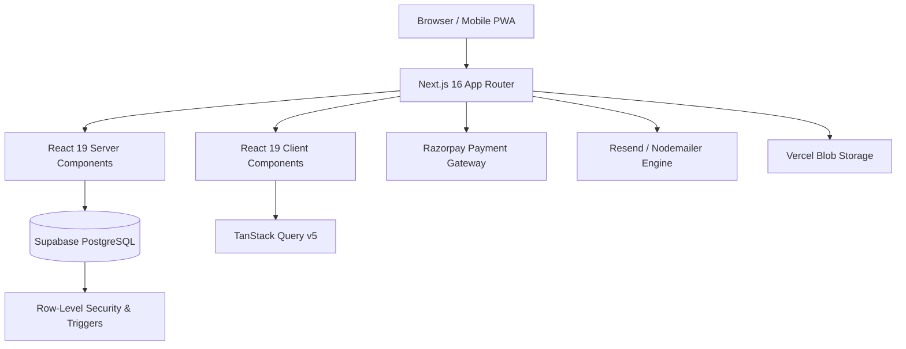
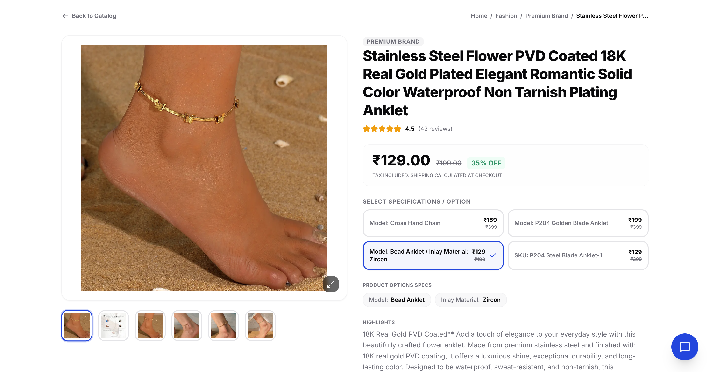
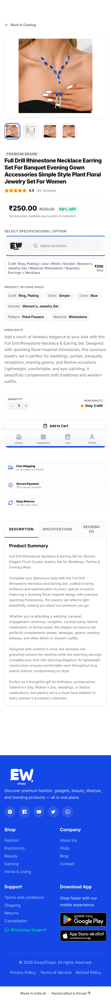
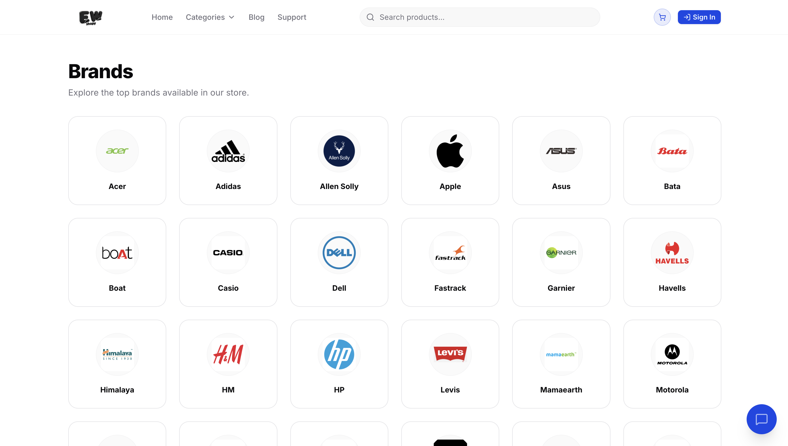
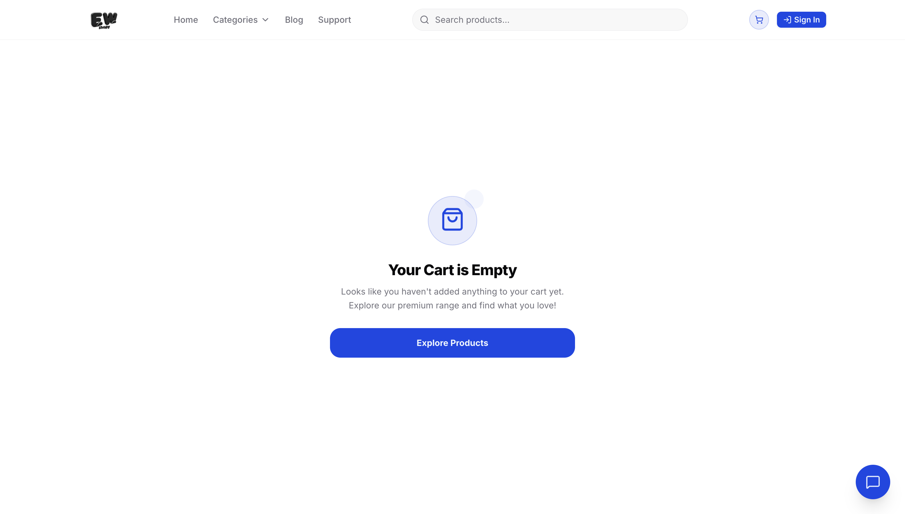
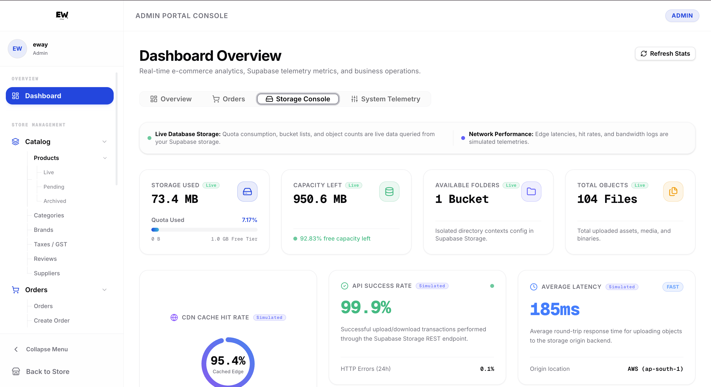
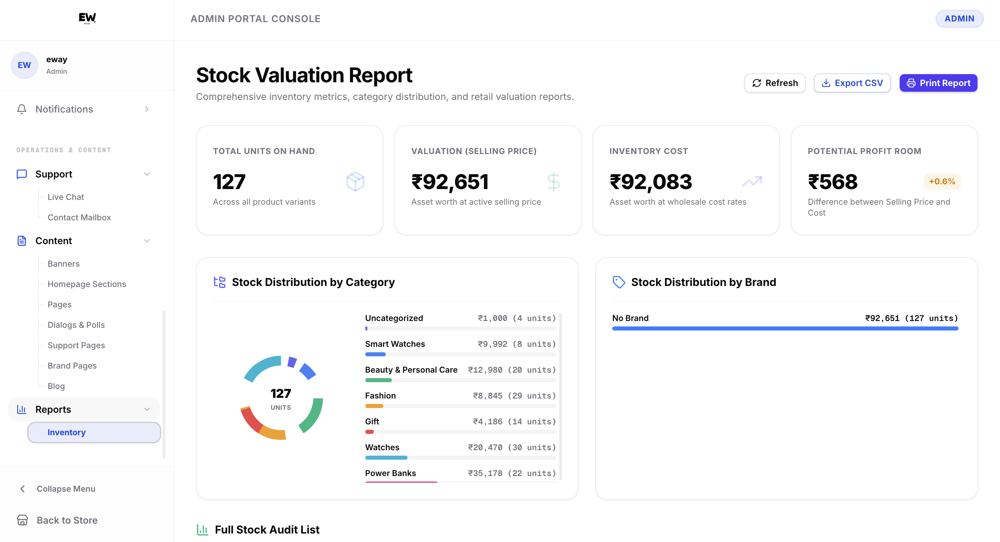

# 🛍️ Eway Shopy — Enterprise E-Commerce & C2C Marketplace Platform

[](https://nextjs.org/)
[](https://reactjs.org/)
[](https://www.typescriptlang.org/)
[](https://tailwindcss.com/)
[](https://supabase.com/)
[](https://web.dev/progressive-web-apps/)

---

## 🌟 Executive Overview

**Eway Shopy** is a full-stack, enterprise-grade E-Commerce ecosystem and Peer-to-Peer (C2C) Marketplace platform engineered for high performance, dynamic content administration, and seamless omnichannel shopping experiences. 

Designed with modern server architecture, robust security guarantees (Row-Level Security), and responsive interfaces across desktop, tablet, and mobile viewports, **Eway Shopy** handles everything from product discovery and payment processing to automated stock restoration, return handling, multi-channel customer communication, and real-time inventory management.

> 🔒 **Security Notice**: This documentation repository serves as an architectural blueprint and visual showcase. For security, compliance, and proprietary reasons, source code files and production database credentials have been excluded.

---
For Visit Live : www.ewayshopy.in
## ✨ Key Platform Highlights

### 🛒 1. Customer Storefront & Dynamic Discovery
- **High-Performance Product Browsing**: Instant search, dynamic collection filtering, brand catalogs, and categorized navigation.
- **Rich Product Detail Pages**: Image gallery carousels, customer reviews with image uploads, dynamic pricing calculation, stock indicators, and related product recommendations.
- **Smart Cart & Seamless Checkout**: Multi-item slide-over cart drawer, address validation, coupon code engine, automated tax/GST breakdown, and integrated Razorpay payment gateway.
- **Progressive Web App (PWA)**: Mobile installability, offline caching strategy, background sync, and instant app-like interactions.

### 🔄 2. Peer-to-Peer (C2C) Marketplace
- **Community Marketplace**: Enables authenticated buyers to publish pre-owned/used item listings with condition ratings, photos, and dynamic pricing.
- **Direct Buyer-Seller Messaging**: Integrated inquiry and communication flow for marketplace listings.
- **Moderation & Flagging System**: Community safety tools with listing reports, category filtering, and administrative oversight.

### 🛡️ 3. Comprehensive Admin Operations Hub
- **Executive Analytics Dashboard**: Real-time sales metrics, revenue analytics, stock velocity graphs, and order volume breakdowns powered by dynamic Recharts visualizers.
- **Order Lifecycle Management**: End-to-end processing (Pending, Packed, Shipped, Delivered, Cancelled), automatic invoice generation, and printable shipping slips.
- **Inventory & Supplier Management**: Real-time stock tracking, automated stock restoration triggers on order cancellation/return, low-stock alerts, and supplier profiles.
- **Marketing & Campaign Engine**: Dynamic percentage & fixed-amount discount codes, coupon usage limits, category/product-specific applicability rules, hero slider management, and promotional modal popups.

### 📑 4. Dynamic CMS & Content Administration
- **Banner & Slide Manager**: Custom promotional slides with target link routing, priority ordering, and mobile display options.
- **Support & Custom Page Builder**: Dynamic WYSIWYG support page management (Terms, Privacy Policy, Return Policy, FAQ, About Us).
- **Blog Engine**: Article publishing with rich media, category tagging, and SEO metadata.
- **Announcement Dialogs**: Global modal dialogs and sticky alert banners configurable directly from the admin panel.

### 📲 5. Omnichannel Notification Engine
- **Multi-Channel Delivery**: Integrated support for Email (Resend & Nodemailer), WhatsApp business logging, and in-app customer notification center.
- **Automated Trigger Logs**: Order confirmation, shipment status updates, password resets, and promotional outreach logging.

---

## 🏗️ Technical Architecture & Stack



### Core Technologies

| Category | Technology | Usage & Rationale |
| :--- | :--- | :--- |
| **Framework** | **Next.js 16.2.6** | App Router, Server Actions, Dynamic Layouts, SSR/SSG Optimizations |
| **UI Library** | **React 19.2.4** | Server Components, Concurrent Mode, Action Hooks |
| **Language** | **TypeScript 5** | Strict type definitions across UI components, API models, and database types |
| **Styling** | **Tailwind CSS v4** | Modern utility-first CSS engine with dark mode theme switching (`next-themes`) |
| **Components** | **Radix UI & shadcn** | Accessible, unstyled UI primitives tailored for complex dialogs and popovers |
| **Database** | **Supabase (PostgreSQL)** | Relational database, Auth, Realtime listeners, and Row-Level Security (RLS) |
| **State Management** | **TanStack Query v5** | Server state caching, optimistic UI updates, and background refetching |
| **Analytics & Charts** | **Recharts 3.8** | Dynamic data visualizations for sales trends, revenue, and inventory metrics |
| **Payments** | **Razorpay SDK** | Secure online payment gateway integration |
| **Media & Storage** | **Vercel Blob** | High-speed cloud storage for product images and review uploads |

---

## 🗄️ Database & Security Architecture

Eway Shopy is powered by a robust PostgreSQL relational database hosted on Supabase, guarded by over 20 modular SQL migration scripts enforcing strict integrity and automated business logic.

```
├── enable_rls_all_tables.sql       # Enforces Row-Level Security (RLS) across 100% of tables
├── order_system_complete.sql       # Order state transitions, stock deductions, and invoice schemas
├── create_returns_system.sql       # Automated return request approval & stock restoration triggers
├── create_marketplace_listings.sql # C2C Marketplace listings, interactions, and reporting
├── gst_and_settings_migration.sql  # Tax configurations, HSN codes, and platform settings
├── dynamic_campaigns.sql          # Popup modals, homepage announcement banners
└── product_reviews.sql             # Customer reviews with image relationship schemas
```

### Database Security Highlights
- **100% Row Level Security (RLS)**: Enforces table policies preventing unauthorized data access between shoppers, marketplace sellers, and administrative staff.
- **Automated Stock Restoration Triggers**: Custom PostgreSQL triggers that automatically increment product stock quantities when order cancellation or return requests are processed.
- **Audit & Notification Logging**: Transactional log tables tracking WhatsApp messages, email dispatch statuses, and administrative activity.

---

## 💎 Code Quality & Engineering Best Practices

1. **Decoupled Feature Architecture**:
   - Organized into clean domain boundaries (`/app`, `/components`, `/modules`, `/hooks`, `/lib`).
2. **Type-Safe API & Database Contract**:
   - Zero `any` policy for business logic models; full TypeScript coverage for database entities, shopping cart payloads, and order lifecycle states.
3. **Resilient Network & Fallback Handling**:
   - Graceful offline PWA fallback support via dynamic offline page routing (`/~offline`).
   - LocalStorage fallback state recovery for offline storefront browsing.
4. **Responsive-First UI Design**:
   - Pixel-perfect adaptability across all viewports (Mobile 390px, Tablet 768px, Desktop 1440px+).

---

## 📸 Comprehensive Visual Gallery

Below is a complete side-by-side preview showcasing the responsiveness and user experience of **Eway Shopy** across **Desktop** and **Mobile** viewports.

---

### 🏡 1. Storefront Home Page

| Desktop View (1440px) | Mobile View (390px) |
| :---: | :---: |
|  |  |

---

### 📦 2. Product Detail & Interactive Review System

| Desktop View (1440px) | Mobile View (390px) |
| :---: | :---: |
|  |  |

---

### 🗂️ 3. Categories & Brand Catalog

| Desktop View (1440px) | Mobile View (390px) |
| :---: | :---: |
|  |  |

---

### 🔄 4. Peer-to-Peer (C2C) Used Marketplace

| Desktop View (1440px) | Mobile View (390px) |
| :---: | :---: |
|  |  |

---

### 🛒 5. Shopping Cart & Checkout Process

| Desktop View (1440px) | Mobile View (390px) |
| :---: | :---: |
|  |  |

---

### 👤 6. Customer Profile & Order History

| Desktop View (1440px) | Mobile View (390px) |
| :---: | :---: |
|  |  |

---

### 📊 7. Admin Control Panel & Operations Dashboard

| Desktop View (1440px) | Mobile View (390px) |
| :---: | :---: |
|  |  |

---

### 📦 8. Admin Product & Stock Inventory Management

| Desktop View (1440px) | Mobile View (390px) |
| :---: | :---: |
|  |  |

---

### 🏷️ 9. Admin Marketing, Coupons & Discounts

| Desktop View (1440px) | Mobile View (390px) |
| :---: | :---: |
|  |  |

---

### 📝 10. Admin Content Management (CMS) & Dialogs

| Desktop View (1440px) | Mobile View (390px) |
| :---: | :---: |
|  |  |

---

## 🛠️ Project Structure Overview

```
eway-shopy/
├── app/                        # Next.js 16 App Router pages & server routes
│   ├── (storefront)/           # Public e-commerce & C2C routes
│   │   ├── page.tsx            # Homepage
│   │   ├── products/[slug]/    # Product detail page
│   │   ├── categories/         # Category catalog
│   │   ├── brands/             # Brand pages
│   │   ├── marketplace/        # Peer-to-peer used item listings
│   │   ├── cart/               # Cart drawer & page
│   │   ├── checkout/           # Checkout workflow
│   │   ├── profile/            # User account settings
│   │   ├── orders/             # Order history & tracking
│   │   ├── notifications/      # In-app notification center
│   │   └── blog/               # Article & news feed
│   └── admin/                  # Administrative operations portal
│       ├── page.tsx            # Analytics dashboard
│       ├── products/           # Catalog management
│       ├── inventory/stock/    # Real-time stock control
│       ├── orders/             # Order processing, packing, shipping
│       ├── marketing/          # Coupons & discounts engine
│       ├── content/            # CMS for pages, slides, popups
│       └── settings/           # System & company config
├── components/                 # UI components
│   ├── ui/                     # Radix / shadcn atomic primitives
│   ├── storefront/             # Storefront headers, cards, footers
│   └── admin/                  # Data tables, metrics, chart widgets
├── modules/                    # Feature domain business logic
│   ├── returns/                # Automated return & refund workflows
│   ├── marketplace/            # C2C messaging & listing rules
│   └── tax/                    # Dynamic GST & HSN calculators
├── lib/                        # Core backend clients & helper utilities
│   ├── supabase/               # Database client & auth interfaces
│   ├── email/                  # Resend & Nodemailer dispatchers
│   └── razorpay/               # Payment gateway helper methods
└── sql/                        # Schema migrations, RLS & triggers
```

---

## 📄 License & Attribution

Designed and built as a private enterprise web platform. All rights reserved. 
This repository contains public documentation, architectural specifications, and UI showcases only.
